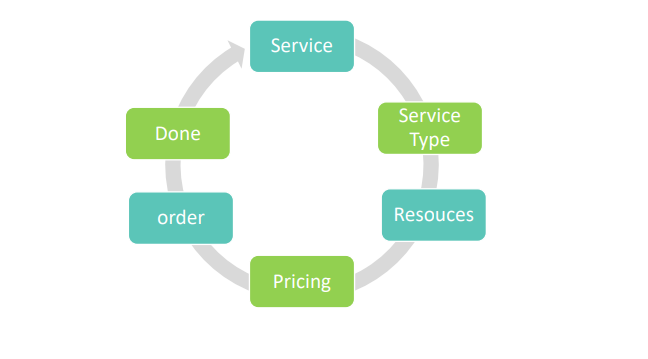

# Booking Platform

## Technologies:

<p align="center">
    <a href="#">
        
    </a>
    <a href="#">
        
    </a>

<a href="#">
        
    </a>

<a href="#">
        
    </a>
</p>

## Introduction
Providing a mechanism for booking a service of a specific type, and creating an automated platform to
link more than one different service that appears in the form of separate applications.
For example, a domestic worker service provider provides services (cleaning - drivers - nursing mothers)
to display the services on the platform and the customer can book the worker, know the prices, and
submit a request to purchase the service
   <p align="center">
          
        </p>  
<p align="center">
          
        </p>  


## Features

- ` Admin | User ` basic operations
    1. **Login and Register**
    1. **Reset Password**
    1. **verify Email** 
    1. **CRUD operations** based on the responsibilities
  2. **Roles & permissions** admin can create many roles and set different permissions for each role.
  3. **Scheduling** Admin can insert many schedules for each resource or Bulk resources with automated services to handle the availability of each resource.
  4. **Booking** Each user can choose specific service and choose its favorite resources for to do this service
- ` STRIPE & PayPal` Payment Integration


## Getting started:

1. Fork this Repository
2. change the current directory to project path ex: ```cd Booking-Api ```
3. At appSettings file set your SQL Server Connection string.
3. run ```  update-database```
4. If you want to make stripe or PayPal payment work, make sure add your keys at your AppSettings file.

